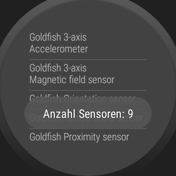
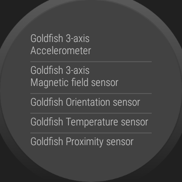

# WearOS-App: "Sensor-Liste"

Android-Studio-Project for a WearOS-App; the app shows simply the names of all sensors
found on the device in a ListView.

 

----
## Screenshots

 

----
# License

See the [LICENSE file](LICENSE.md) for license rights and limitations (BSD 3-Clause License).